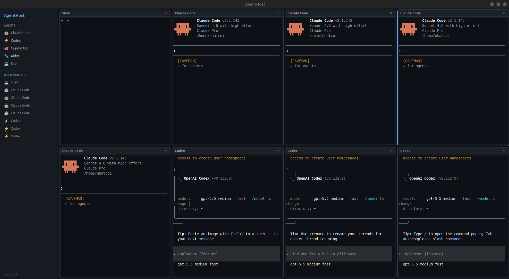

<h1 align="center">🌉 OggyBridge</h1>

<p align="center">
  <strong>One window. All your AI coding agents. Zero chaos.</strong>
</p>

<p align="center">
  <em>Run Claude Code, Codex, GitHub Copilot CLI, Antigravity CLI, and any shell — side by side — with shared workspace awareness.</em>
</p>

<p align="center">
  <a href="#-quick-install"></a>
  <a href="#-features"></a>
  <a href="#-usage"></a>
</p>

<p align="center">
  
  
  
  
</p>


<p align="center">
  
</p>


---

## 💡 Why OggyBridge?

You use multiple AI coding agents. So do we. The problem?

- **Claude Code** is refactoring your auth module
- **Codex** is scaffolding a new API endpoint
- **Antigravity CLI** is fixing a bug in the same file Claude is editing
- You're switching between 4 terminal tabs trying to keep track

**OggyBridge** puts them all in one window with a shared sidebar, so you always know *who* is doing *what* on *which files*.

---

## ✨ Features

### 🖥️ Multi-Agent Terminal Grid

Open as many agent panes as you need. Each agent runs in its own isolated PTY session with full `xterm.js` + WebGL GPU-accelerated rendering. Colors, mouse support, copy/paste — everything works.

### 🤖 One-Click Agent Launch

Click an agent in the sidebar → a new terminal pane spawns with that agent's CLI already running. Supported agents:

| Agent | Command | What it does |
|-------|---------|-------------|
| Claude Code | `claude` | Anthropic's AI coding assistant |
| Codex | `codex` | OpenAI's code generation CLI |
| Copilot CLI | `gh copilot` | GitHub's AI pair programmer |
| Antigravity CLI | `agy` | Antigravity's coding agent in your terminal |
| Shell | `$SHELL` | Plain terminal for anything else |

### 📂 Workspace Sidebar

See all open panes at a glance. Know which agents are active. Launch new ones instantly.

### ⚡ Native Performance

Built with **Tauri 2** (Rust backend + native webview). No Electron. No Node.js PTY. The entire process layer is pure Rust using `portable-pty` from the Wezterm authors. Cold start under 1 second, idle RAM under 250MB with 3 agents running.

### 🎨 Developer-First UI

Dark theme optimized for long coding sessions. GitHub-inspired color palette. JetBrains Mono / Cascadia Code font rendering. Minimal chrome, maximum terminal space.

---

## 📦 Quick Install

### Option 1: Build from Source

```bash
# Clone and build
git clone https://github.com/nhatcoi/agenthost.git
cd agenthost
npm install
cargo tauri build

# The binary will be in target/release/bundle/
```

### Option 2: Download Release (Linux)

```bash
# Download the latest .deb package
curl -LO https://github.com/nhatcoi/agenthost/releases/latest/download/agenthost_amd64.deb
sudo dpkg -i agenthost_amd64.deb

# Or the AppImage (no install needed)
curl -LO https://github.com/nhatcoi/agenthost/releases/latest/download/agenthost_amd64.AppImage
chmod +x agenthost_amd64.AppImage
./agenthost_amd64.AppImage
```

### Option 3: Download Release (macOS)

```bash
curl -LO https://github.com/nhatcoi/agenthost/releases/latest/download/AgentHost.dmg
open AgentHost.dmg
```

### System Requirements

| | Minimum |
|---|---------|
| **OS** | Ubuntu 22.04+ / Fedora 39+ / macOS 14+ |
| **Rust** | Stable (latest) — [rustup.rs](https://rustup.rs) |
| **Node.js** | ≥ 18 |

<details>
<summary><strong>Linux system dependencies (one-time, for building from source)</strong></summary>

```bash
sudo apt-get install -y \
  libwebkit2gtk-4.1-dev libgtk-3-dev libssl-dev libdbus-1-dev \
  libayatana-appindicator3-dev librsvg2-dev libglib2.0-dev \
  libsoup-3.0-dev libjavascriptcoregtk-4.1-dev
```

</details>

---

## 🚀 Usage

### Launch

```bash
# From source (dev mode with hot reload)
cargo tauri dev

# Or if installed via .deb / .AppImage / .dmg
agenthost
```

### Workflow

1. **Open OggyBridge** — a Shell pane opens by default
2. **Click an agent** in the sidebar (e.g., "Claude Code") — a new pane spawns with `claude` running
3. **Add more agents** — click Codex, Antigravity CLI, another Shell, whatever you need
4. **Work in parallel** — each agent has its own full terminal; type, scroll, copy/paste independently
5. **Monitor from the sidebar** — see all active panes at a glance, close any with one click

---

## 🏗️ Architecture

```
┌─────────────────────────── OggyBridge Window ─────────────────────┐
│  ┌─ Sidebar ──┐  ┌─ Agent Pane Grid ─────────────────────────────┐│
│  │ Agents     │  │ ┌─Claude Code─┐ ┌─Codex─────┐ ┌─Antigravity──┐││
│  │ Open Panes │  │ │ xterm.js    │ │ xterm.js  │ │ xterm.js     │││
│  │            │  │ │ (pty)       │ │ (pty)     │ │ (pty)        │││
│  │            │  │ └─────────────┘ └───────────┘ └──────────────┘││
│  └────────────┘  └────────────────────────────────────────────────┘│
└────────────────────────────────────────────────────────────────────┘
         │                                  │
         │ Tauri IPC (no HTTP, no WS)       │
         ▼                                  ▼
┌────────────────── Rust Backend ────────────────────────────────────┐
│   PTY Manager (portable-pty)  ←→  Agent CLI processes             │
│   One PTY session per pane    ←→  claude / codex / gh / agy       │
└───────────────────────────────────────────────────────────────────-┘
```

**No Electron. No Node.js.** The entire backend is Rust. Each agent runs in a real PTY (same tech as Wezterm), rendered via xterm.js with WebGL acceleration in the native webview.

---

## 🧰 Tech Stack

| Component | Technology |
|-----------|-----------|
| App shell | [Tauri 2.x](https://v2.tauri.app) — Rust + native webview |
| Frontend | React 18 + TypeScript + Vite |
| Terminal | [xterm.js](https://xtermjs.org) + `@xterm/addon-webgl` |
| PTY | [`portable-pty`](https://crates.io/crates/portable-pty) (from Wezterm) |
| Packaging | `.deb` / `.AppImage` / `.dmg` — zero runtime dependencies |

---

## 📁 Project Structure

```
agenthost/
├── src/                      # React frontend
│   ├── App.tsx               # Root layout (sidebar + pane grid)
│   ├── panes/
│   │   ├── PaneGrid.tsx      # Multi-pane tile layout
│   │   └── TerminalPane.tsx  # xterm.js ↔ Tauri IPC bridge
│   └── overview/
│       └── Sidebar.tsx       # Agent launcher + open pane list
│
├── src-tauri/                # Rust backend
│   ├── tauri.conf.json       # App config (window, bundler, CSP)
│   └── src/lib.rs            # IPC: create_pty / write_pty / resize_pty / kill_pty
│
└── crates/
    └── pty/                  # PTY session wrapper over portable-pty
        └── src/lib.rs        # PtySession: spawn, write, resize
```

---

## 🔧 Configuration

### Adding Custom Agents

Edit the agent registry in `src/App.tsx`:

```typescript
const AGENTS = [
  { id: "claude-code", label: "Claude Code", cmd: "claude" },
  { id: "codex",       label: "Codex",       cmd: "codex" },
  { id: "copilot",     label: "Copilot CLI", cmd: "gh" },
  { id: "antigravity", label: "Antigravity CLI", cmd: "agy" },
  { id: "shell",       label: "Shell",       cmd: "" },  // uses $SHELL
  // Add your own:
  { id: "cursor",      label: "Cursor CLI",  cmd: "cursor" },
];
```

Any CLI tool that runs in a terminal can be added as an agent.

### Terminal Theme

Customize colors in `src/panes/TerminalPane.tsx` — uses a GitHub Dark-inspired palette by default:

```typescript
theme: {
  background: "#0d1117",
  foreground: "#e6edf3",
  cursor: "#58a6ff",
  // ... full 16-color ANSI palette
}
```

---

## 🤝 Contributing

```bash
# Dev mode (hot reload frontend + Rust recompilation)
cargo tauri dev

# Type-check frontend
npm run build

# Lint Rust
cargo clippy --workspace
```

See [CLAUDE.md](./CLAUDE.md) for architecture decisions, coding conventions, and the IPC contract reference.

---

## 📄 License

MIT — use it, fork it, ship it.

---

<p align="center">
  <sub>Built with 🦀 Rust + ⚛️ React + 🖥️ Tauri — no Electron, no compromises.</sub>
</p>
